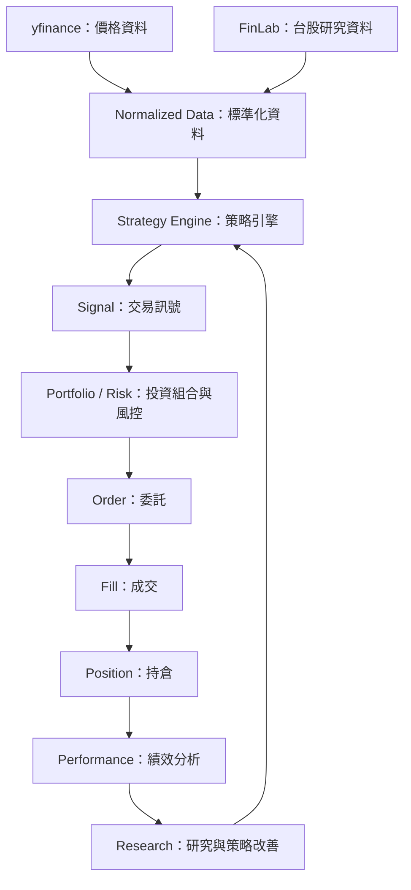

# Quant Flow

Quant Flow 的目標是從 Python 量化研究與基礎回測開始，逐步建立模擬交易、績效分析、台股策略研究，以及即時監控與交易執行流程。

目前此儲存庫包含規劃文件與 Python 程式骨架，所有 `.py` 檔皆為空白。以下架構與開發階段代表預計建置的方向，尚未表示相關功能已完成；各階段工作以核取方塊追蹤。

## 最終目標

建立從資料取得到策略改善的完整循環：

| 層級 | 預計使用工具 | 主要職責 |
| --- | --- | --- |
| 資料層 | FinLab／其他市場資料 | 取得價格、成交量、財報、籌碼與因子資料 |
| 研究層 | FinLab + Python | 因子研究、選股與回測，評估條件在歷史資料中的表現 |
| 策略／訊號層 | Python | 定義選股、進出場、部位管理與風控規則，產生每日訊號 |
| 即時監控層 | XQ | 觀察即時行情、技術面與警示，確認盤中市場狀態 |
| 執行層 | XQ／券商 API／人工下單 | 串接委託、成交與持倉流程 |
| 績效與迭代層 | Python + FinLab | 記錄交易、損益與滑價，比較實盤與回測，回饋研究流程 |

## 系統架構

以下為預計建立的核心資料流。初期先使用 yfinance，後續再抽象化資料介面並加入 FinLab。



XQ 即時監控與券商交易串接會在 phase6 推進；此前先建立回測與模擬交易所需的流程。

## 開發階段

開發順序依據 [prompt.md](./prompt.md)，分為 phase1 至 phase6。每個階段列出目標、工作項目與完成條件，作為後續實作與驗收依據。

### phase1：基礎回測流程

**目標：** 使用 yfinance，跑通 `Data → Strategy → Signal → Backtest`。

**工作項目：**

- [ ] 取得並整理 yfinance 歷史價格資料。
- [ ] 定義一個基礎策略及其輸入資料。
- [ ] 根據策略規則產生交易訊號。
- [ ] 將訊號接入基礎回測，輸出交易紀錄與回測結果。

**完成條件：** 能以固定資料範圍與策略參數，重現從資料取得到回測結果的完整流程。

### phase2：模擬交易系統

**目標：** 加入 `Portfolio → Order → Fill → Position`，建立完整模擬交易流程。

**工作項目：**

- [ ] 建立投資組合管理，追蹤資金與部位配置。
- [ ] 將交易訊號轉為委託，加入基本部位限制與風控規則。
- [ ] 定義模擬成交規則，產生成交紀錄。
- [ ] 依成交結果更新現金與持倉。

**完成條件：** 能串起訊號、委託、模擬成交及持倉更新，且資金與部位變化可由交易紀錄核對。

### phase3：績效分析與研究驗證

**目標：** 建立 `Performance → Research` 的回饋流程，評估策略表現與回測可信度。

**工作項目：**

- [ ] 計算並理解 MDD（最大回撤）與 Sharpe Ratio（夏普比率）。
- [ ] 選定 Benchmark（比較基準），比較策略與基準的表現。
- [ ] 納入 Slippage（滑價）假設，觀察對回測結果的影響。
- [ ] 檢查資料可取得時間、訊號產生時間與成交時間，排查 Look-ahead Bias（前視偏誤）。
- [ ] 整理績效結果與研究紀錄，作為策略調整依據。

**完成條件：** 能產出包含績效指標、基準比較與滑價假設的分析結果，並記錄前視偏誤的檢查方式及結果。

> 本階段集中進行研究驗證，但從 phase1 起就應注意資料時間順序，避免使用決策當下尚未取得的資訊。

### phase4：資料來源抽象化

**目標：** 建立統一的 `DataProvider` 介面，讓策略透過一致的方式取得資料。

**工作項目：**

- [ ] 定義 `DataProvider` 的資料存取介面與標準化輸出格式。
- [ ] 將現有 yfinance 存取流程整理為 `YahooFinanceProvider`。
- [ ] 建立 `FinLabProvider`，對接統一介面。
- [ ] 明確處理不同來源的欄位、時間索引與缺失資料差異。

**完成條件：** 對於兩個來源皆支援的資料需求，能透過相同介面取得標準化資料，並接入既有策略與回測流程。

### phase5：台股量化策略研究

**目標：** 使用 FinLab 的台股財報、營收、籌碼與因子資料，建立台股策略研究流程。

**工作項目：**

- [ ] 透過 `FinLabProvider` 取得研究所需的台股資料。
- [ ] 整理財報、營收與籌碼資料，確認其可取得時間。
- [ ] 定義因子與選股條件，形成可回測的策略規則。
- [ ] 沿用既有回測與績效分析流程，評估台股策略。
- [ ] 記錄研究假設、參數與結果，方便重現及比較。

**完成條件：** 至少完成一個台股策略的資料整理、因子或選股規則、回測與績效分析，並保留可重現的研究紀錄。

### phase6：即時監控與交易實作

**目標：** 依序推進 `XQ／券商 → 即時監控 → Paper Trading → 小資金實盤`。

**工作項目：**

- [ ] 規劃 XQ／券商與既有策略訊號、交易流程的銜接方式。
- [ ] 建立即時行情監控與警示流程。
- [ ] 進行 Paper Trading（模擬交易），驗證即時訊號、委託與持倉更新。
- [ ] 訂定小資金實盤的資金上限、部位限制與停止交易條件。
- [ ] 在模擬驗證通過後進行小資金實盤，保留委託、成交與持倉紀錄。
- [ ] 比較實盤與回測的損益、滑價及執行差異，回饋研究流程。

**完成條件：** 完成即時監控與 Paper Trading 驗證，再依事先訂定的限制完成小資金實盤驗證，並能追蹤交易紀錄及分析實盤與回測差異。

## 專案目錄

Python 程式骨架位於 `src/quant_flow/`，依照資料、策略、訊號、投資組合與風控、委託、成交、持倉及績效分析分層。下圖註解說明各檔案預計承擔的職責，目前尚未加入程式內容。

```text
quant-flow-docs/
├── README.md                 # 專案介紹、系統架構與開發階段
├── ultimate-goal.md          # 最終目標與六層系統規劃
├── program-architecture.md   # 核心程式架構與資料流
├── prompt.md                 # 開發階段原始規劃
├── docs/
│   ├── git-flow.md           # Git Flow 分支說明
│   └── flow.jpg              # Git Flow 分支流程圖
└── src/
    └── quant_flow/
        ├── __init__.py
        ├── main.py           # 主流程入口
        ├── data/
        │   ├── __init__.py
        │   ├── normalizer.py # 資料標準化
        │   └── providers/
        │       ├── __init__.py
        │       ├── base.py   # 資料來源共用介面
        │       ├── yahoo_finance.py # yfinance 資料來源
        │       └── finlab.py # FinLab 資料來源
        ├── strategy/
        │   ├── __init__.py
        │   └── engine.py     # 策略引擎
        ├── signals/
        │   ├── __init__.py
        │   └── signal.py     # 交易訊號
        ├── portfolio/
        │   ├── __init__.py
        │   ├── portfolio.py  # 投資組合管理
        │   └── risk.py       # 風險控制
        ├── orders/
        │   ├── __init__.py
        │   └── order.py      # 委託
        ├── fills/
        │   ├── __init__.py
        │   └── fill.py       # 成交
        ├── positions/
        │   ├── __init__.py
        │   └── position.py   # 持倉
        └── performance/
            ├── __init__.py
            └── metrics.py    # 績效指標
```

## 相關文件

- [最終目標](./ultimate-goal.md)
- [程式架構](./program-architecture.md)
- [開發階段原始規劃](./prompt.md)
- [Git Flow 分支說明](./docs/git-flow.md)
