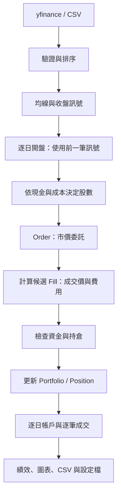
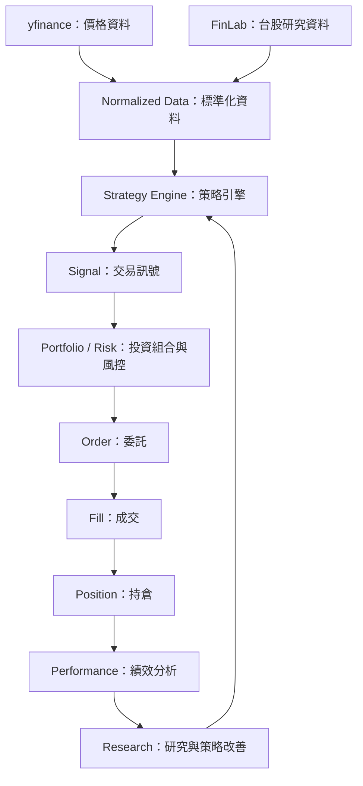

# Quant Flow

## 從 Excel／CSV 自動選股

編輯根目錄的 `watchlist.csv`，保留第一列 `symbol`，下面每列放一個股票代號。
雙擊 `run-screen.cmd`，即可自動讀取清單、下載日線並選股，不必逐檔輸入代號。
若根目錄有 `watchlist.xlsx`，雙擊入口會優先讀取 Excel；否則使用 `watchlist.csv`。
首次使用請依下方步驟建立 `.venv` 並安裝相依套件；既有環境請重新執行
`.\.venv\Scripts\python.exe -m pip install -e .`，安裝 Excel 所需的 openpyxl。

預設條件為最新可取得日線的 **5 日均線高於 20 日均線**，不是只選當日交叉。
輸出位於 `outputs/時間_識別碼/`：`selected.csv` 是入選名單，
`screening.csv` 記錄全部股票的條件結果、資料日期與失敗原因。單檔失敗會繼續處理其他股票。
清單欄名沿用「英文（中文）」格式。所有資料完整的股票，不論是否入選，都會使用同一份股價資料接著回測，
各自在同次執行的 `outputs/時間_識別碼/股票代號/` 產生原有完整報表：中英文 CSV、`config.json`、
`equity.png` 與中文說明；原有欄位與圖片格式保持不變。
若個別股票的報表產生失敗，清單的 `report_error（報表錯誤）` 會記錄原因，其他股票仍繼續處理。
這個入口執行選股，不會自動下單；使用的是資料來源最新可取得日線，盤中資料可能尚未收盤。

清單支援 UTF-8 CSV 與 `.xlsx` 的第一個工作表。預設欄名 `symbol`；
其他欄名可使用 `--symbol-column 股票代號`。空白列會略過，重複代號只處理一次。
也接受原有的 `symbol（股票代碼）` 欄名，可直接將 `selected.csv` 當成下一次的股票清單。
純數字代號預設加 `.TW`；上櫃股票請明確填入例如 `6488.TWO`。
Excel 的代號欄請先設為「文字」，再輸入 `0050` 或完整代號 `0050.TW`，
避免 Excel 已將前導零刪掉；程式不會猜測補回遺失的零。

```powershell
# Excel 清單，自動選出均線多頭股票
.\.venv\Scripts\python.exe -m quant_flow.main --symbols-file watchlist.xlsx --screen trend

# 最新一天剛發生黃金交叉，採 10 / 30 日均線
.\.venv\Scripts\python.exe -m quant_flow.main --symbols-file watchlist.csv --screen cross --short-window 10 --long-window 30

# 只讀取清單，沿用原有逐檔回測流程
.\.venv\Scripts\python.exe -m quant_flow.main --symbols-file watchlist.csv
```

`--symbols-file` 不可同時搭配 `--symbol`；清單／選股模式不可搭配
單檔股價 `--input-csv` 或回放設定 `--config`。股票清單與歷史股價 CSV 是不同用途。

Quant Flow 的目標是從 Python 量化研究與基礎回測開始，逐步建立模擬交易、績效分析、台股策略研究，以及即時監控與交易執行流程。

目前主程式已使用 phase2 帳戶回測（`account_v1`），串接資料驗證、均線訊號、委託、模擬成交、現金與整數股持倉管理。策略與買進持有基準採相同帳戶模型，並輸出逐日帳戶、逐筆成交、績效圖表及重跑設定。phase1 的向量化回測仍保留於專案內；下列開發階段同時保留長期規劃。

## 執行方法（Windows PowerShell）

以下指令在專案根目錄執行。先儲存修改過的檔案，再於 VS Code 開啟 PowerShell 終端機。

### 第一次準備環境

使用 Python 3.13 建立虛擬環境，並安裝專案及其相依套件：

```powershell
cd C:\A_TestSpring\quant-flow-docs
py -3.13 --version
py -3.13 -m venv .venv
.\.venv\Scripts\python.exe -m pip install -e .
```

如果專案放在其他位置，請替換第一行路徑。已建立可用的 Python 3.13 虛擬環境時，只需執行最後一行。

開發模式安裝後，不需要設定 `PYTHONPATH`，以下指令直接使用 `.venv` 內的執行檔。修改 `.py` 後儲存即可重跑；修改 `pyproject.toml` 的相依套件或指令入口，以及重建 `.venv` 後，需重新執行安裝指令。

### 執行回測

預設使用 `2330.TW`、一年資料、5／20 日均線，手續費率及滑價率各為 `0.001`。策略與基準的初始現金各為 `100000`，目前固定於 `main.py`，尚無初始資金的命令列參數。主流程目前以台股日線與單一計價幣別為假設。

```powershell
.\.venv\Scripts\quant-flow.exe
```

指定股票、資料期間與均線週期：

```powershell
.\.venv\Scripts\quant-flow.exe --symbol 0050.TW --period 2y --short-window 10 --long-window 30
```

一次回測多檔股票，在 `--symbol` 後以空格分隔代碼：

```powershell
.\.venv\Scripts\quant-flow.exe --symbol 2330.TW 0050.TW 2317.TW --period 2y --short-window 10 --long-window 30
```

各股票共用期間、均線與費率設定，逐檔獨立回測，每檔使用初始資金 `100000`，集中輸出至同一次執行的 `outputs/時間_識別碼/`，其下再依股票代號分資料夾。未取得股價的股票會略過，繼續下一檔。可使用 `quant-flow-compare.exe` 彙整比較結果。`--input-csv` 與 `--config` 僅支援單檔股票，每檔輸出的 `config.json` 可各自重播。

不計成本與加入成本的範例，可擇一執行：

```powershell
.\.venv\Scripts\quant-flow.exe --fee-rate 0 --slippage-rate 0
.\.venv\Scripts\quant-flow.exe --fee-rate 0.001 --slippage-rate 0.001
```

費率以小數表示，`0.001` 代表 `0.1%`，是回測假設。週期必須符合 `0 < short-window < long-window`。資料不足以形成長均線時可能沒有交易，請選擇足夠長的期間。

查看全部參數：

```powershell
.\.venv\Scripts\quant-flow.exe --help
```

原本的模組執行方式仍可使用：

```powershell
.\.venv\Scripts\python.exe -m quant_flow.main
```

### 使用既有 CSV

在 VS Code 對先前輸出的 `input_prices.csv` 按右鍵 →「複製路徑」。以下引號內是佔位文字，必須替換成實際路徑：

```powershell
.\.venv\Scripts\quant-flow.exe --symbol 2330.TW --input-csv "貼上 input_prices.csv 的完整路徑" --short-window 10 --long-window 30
```

此模式不下載資料，`--period` 不生效。`--symbol` 用於委託、持倉及報表，但程式不驗證 CSV 的股票身分，請確保兩者對應。均線與費率採命令列值或預設值，不會自動讀取舊設定。CSV 讀取器將日期轉為 UTC；帳戶回測再轉至 `Asia/Taipei`，以每筆資料日期的上午 9 點記錄開盤事件。保存的輸入日期與帳戶報表時間因此可能顯示不同時區。

### 使用設定檔重跑

複製先前 `config.json` 的完整路徑，替換以下佔位文字：

```powershell
.\.venv\Scripts\quant-flow.exe --config "貼上 config.json 的完整路徑"
```

設定檔會覆蓋股票、均線、費率與輸入檔參數，並停用下載期間。股價路徑以設定檔所在目錄加上 `data.file` 解析；搬移報表時，請保留整個執行資料夾。

重跑需使用相同程式邏輯與相容套件環境。`pyproject.toml` 目前沒有鎖定相依套件版本。

新設定檔包含 `"engine": "account_v1"` 與 `"initial_cash": "100000"`，目前這兩個欄位僅供紀錄，CLI 尚未讀取它們來切換模型或初始資金。舊 phase1 設定檔也會使用目前的帳戶模型重跑，因整數股、剩餘現金及成本計算方式不同，不能期待與舊報表相同。手動修改設定檔的 `initial_cash` 不會改變本次初始現金。

### 報表與圖表

每次執行建立一個 `outputs/<年-月-日_時-分-秒_識別碼>/`，使用電腦本地時間與 24 小時制，例如 `outputs/2026-09-29_15-00-00_a1b2c3d4/2330.TW/`。依資料夾名稱排序即可查看執行先後（同秒執行以識別碼區分）。股票報表放在其下的代號資料夾，同次選股總表也放在該次執行資料夾。多次執行分開保存，不覆寫歷史報表；彙整工具同時支援舊版與新版目錄。

```text
outputs/
├── 歷史報表/                    # 本次整理移入的舊報表
└── 2026-09-29_15-00-00_a1b2c3d4/ # 一次執行：15 時 00 分 00 秒
    ├── 0050.TW/
    ├── 00919.TW/
    ├── 2409.TW/
    ├── screening.csv           # 選股模式：全部股票結果
    └── selected.csv            # 選股模式：入選清單
```

每個股票資料夾均保留以下完整報表。`歷史報表/` 是已整理的舊資料，新執行不會自動搬移歷史資料；彙整時也會讀取其中的報表。

| 檔案 | 內容 |
| --- | --- |
| `input_prices.csv` | 驗證及排序後、策略實際使用的股價 |
| `strategy.csv` | 均線策略每日的目標持倉、實際股數、現金、市值與淨值 |
| `benchmark.csv` | 買進持有基準的每日帳戶狀態 |
| `trades.csv` | 策略逐筆成交的方向、股數、成交價、費用與現金變化 |
| `benchmark_trades.csv` | 基準的逐筆成交紀錄 |
| `summary.csv` | 兩組策略的累積報酬與最大回撤 |
| `config.json` | 模型、初始現金、策略參數、資料來源與日期範圍 |
| `equity.png` | 淨值與回撤曲線，可在 VS Code 點選預覽 |
| `中文說明.md` | 各報表用途、欄位中文解釋、數值單位與設定說明 |

CSV 欄名以「英文（中文）」顯示，例如 `Open（開盤價）`、`Cash（現金）`、`total_return（累積報酬率）`，包含股價輸入副本與彙整比較表。重播及比較工具同時支援舊版英文欄名。圖片的標題、圖例及座標軸也附上中文；Windows 使用微軟正黑體，其他系統可安裝 Noto Sans CJK TC 以顯示中文。

CSV 中報酬 `0.12` 代表 `12%`；最大回撤以負值表示，例如 `-0.25` 代表從先前高點回落 `25%`。

每日帳戶欄位：

| 欄位 | 意義 |
| --- | --- |
| `Date` | 台灣時間的模擬開盤時間 |
| `Open` | 原始開盤價，尚未加上滑價 |
| `Target` | 前一筆收盤訊號：`1` 希望持有，`0` 希望空手 |
| `Quantity` | 處理當日交易後的實際持有股數 |
| `Cash` | 處理當日交易與費用後的現金 |
| `Market_Value` | 持有股數乘以當日原始開盤價 |
| `Total_Equity` | 現金加上股票市值 |
| `Equity` | 總資產除以初始現金，供績效分析與繪圖使用 |

逐筆成交欄位為 `Symbol`、`Side`、`Quantity`、`Price`、`Gross_Amount`、`Fee`、`Cash_Change`、`Created_At`、`Executed_At`。`Side` 為 `BUY` 或 `SELL`，`Price` 已含滑價；`Fee` 僅記錄比例手續費。買入的 `Cash_Change` 為負、賣出為正。没有成交時仍會輸出欄名。

可用以下關係核對策略報表，基準亦同：

```text
初始現金 + trades.csv 的 Cash_Change 加總 = 最後一列 Cash
買入股數加總 - 賣出股數加總 = 最後一列 Quantity
Cash + Market_Value = Total_Equity
```

成交金額以 Decimal 字串輸出；每日帳戶轉為浮點數供分析，因此核對時需容許微小的浮點誤差。`strategy.csv` 不再包含 phase1 的逐日報酬欄位；`Target` 是當日使用的前一筆訊號，不是當天收盤的新訊號。

彙整所有既有結果：

```powershell
.\.venv\Scripts\quant-flow-compare.exe
```

結果寫入 `outputs/comparison.csv`，再次彙整會覆寫這張表，不會修改各次回測資料夾。比較均線參數時，請使用相同股價資料與費率；相同日期範圍及筆數不保證價格完全相同。

目前比較工具尚未依 `engine` 與 `initial_cash` 區分結果，也未將這兩欄加入比較表。請檢查各次設定檔，避免把 phase1 與 phase2 報表視為相同模型的結果。

### 執行測試

執行全部測試：

```powershell
.\.venv\Scripts\python.exe -m unittest discover -s src/quant_flow/tests -v
```

只執行 CLI 測試：

```powershell
.\.venv\Scripts\python.exe -m unittest discover -s src/quant_flow/tests -p test_cli.py -v
```

測試位於 `src/quant_flow/tests`，不是專案根目錄的 `tests`。

只驗證主程式的離線帳戶回測與報表輸出：

```powershell
.\.venv\Scripts\python.exe -m unittest discover -s src/quant_flow/tests -p test_main_account.py -v
```

目前共有 43 個測試，已涵蓋委託、成交、部位、資金檢查、股數計算、逐日模擬，以及離線主流程的報表與圖片輸出、成交現金核對和零成交匯出。

### 目前回測假設

- 單一股票、只做多、不放空。空手且目標為持有時，依可用現金計算包含成本後可買的整數股數；不足一股就略過。已持有且目標仍為持有時不加碼，目標為空手時全數賣出。
- 前一筆資料收盤決定方向，當日開盤才決定股數、建立委託並模擬成交。委託與成交可有相同時間戳；這是以已知開盤價立即執行的日線簡化模型，並非真實市場保證可成交的價格。
- 買入成交價為開盤價乘以 `1 + slippage_rate`，賣出為開盤價乘以 `1 - slippage_rate`。手續費為成交金額乘以 `fee_rate`；滑價已反映於價格，不會再扣一次。
- 市價委託一次全部成交，尚未處理部分成交、流動性、委託狀態、重複成交防護、交易稅、最低手續費、費用取整與價格跳動單位。
- 成交前檢查資金及可賣股數，帳戶更新亦保留檢查。現金與平均成本使用 `Decimal`；平均成本不含手續費，賣出部分持倉不改變剩餘部位的平均成本。
- 基準同樣使用初始現金 `100000` 與整數股模型，從第二筆資料開盤嘗試買入；若當天不足一股，持有目標會在後續日期繼續嘗試。均線策略的暖機空手期包含在比較期間內。
- 結束時不強制平倉，淨值估值至最後一筆開盤，回撤不包含盤中跌幅。
- yfinance 使用未自動調整價格，尚未處理股息、拆股與交易日曆缺漏。

## 最終目標

建立從資料取得到策略改善的完整循環：

| 層級 | 預計使用工具 | 主要職責 |
| --- | --- | --- |
| 資料層 | FinLab／其他市場資料 | 取得價格、成交量、財報、籌碼與因子資料 |
| 研究層 | FinLab + Python | 因子研究、選股與回測，評估條件在歷史資料中的表現 |
| 策略／訊號層 | Python | 定義選股、進出場、部位管理與風控規則，產生每日訊號 |
| 即時監控層 | XQ | 觀察即時行情、技術面與警示，確認盤中市場狀態 |
| 執行層 | XQ／券商 API／人工下單 | 串接委託、成交與持倉流程 |
| 績效與迭代層 | Python + FinLab | 記錄交易、損益與滑價，比較實盤與回測，回饋研究流程 |

## 系統架構

目前主程式的 phase2 流程：



以下為預計建立的核心資料流。初期先使用 yfinance，後續再抽象化資料介面並加入 FinLab。



XQ 即時監控與券商交易串接會在 phase6 推進；此前先建立回測與模擬交易所需的流程。

## 開發階段

開發順序依據 [prompt.md](./prompt.md)，分為 phase1 至 phase6。每個階段列出目標、工作項目與完成條件，作為後續實作與驗收依據。

### phase1：基礎回測流程

**目標：** 使用 yfinance，跑通 `Data → Strategy → Signal → Backtest`。

**工作項目：**

- [x] 取得並整理 yfinance 歷史價格資料。
- [x] 定義一個基礎策略及其輸入資料。
- [x] 根據策略規則產生交易訊號。
- [x] 將訊號接入基礎回測，輸出交易紀錄與回測結果。

基礎流程已跑通，phase2 也已補上逐筆成交紀錄。保存資料及參數可用於相同版本的重跑；跨模型版本的結果不保證相同。

**完成條件：** 能以固定資料範圍與策略參數，重現從資料取得到回測結果的完整流程。

### phase2：模擬交易系統

**目標：** 加入 `Portfolio → Order → Fill → Position`，建立完整模擬交易流程。

**工作項目：**

- [x] 建立投資組合管理，追蹤資金與部位配置。
- [x] 將交易訊號轉為委託，加入基本部位限制與風控規則。
- [x] 定義模擬成交規則，產生成交紀錄。
- [x] 依成交結果更新現金與持倉。

上述項目已完成單一股票、只做多、一次全部成交的基礎版本；仍待加入可設定初始資金、模型相容性檢查，以及更完整的委託與成交管理。

**完成條件：** 能串起訊號、委託、模擬成交及持倉更新，且資金與部位變化可由交易紀錄核對。

### phase3：績效分析與研究驗證

**目標：** 建立 `Performance → Research` 的回饋流程，評估策略表現與回測可信度。

**工作項目：**

- [ ] 計算並理解 MDD（最大回撤）與 Sharpe Ratio（夏普比率）。
- [ ] 選定 Benchmark（比較基準），比較策略與基準的表現。
- [ ] 納入 Slippage（滑價）假設，觀察對回測結果的影響。
- [ ] 檢查資料可取得時間、訊號產生時間與成交時間，排查 Look-ahead Bias（前視偏誤）。
- [ ] 整理績效結果與研究紀錄，作為策略調整依據。

**完成條件：** 能產出包含績效指標、基準比較與滑價假設的分析結果，並記錄前視偏誤的檢查方式及結果。

目前已有累積報酬、MDD、買進持有比較、固定比例滑價與訊號時間對齊測試；Sharpe Ratio 與完整研究偏誤檢查尚未完成，因此不將本階段整體標記為完成。

> 本階段集中進行研究驗證，但從 phase1 起就應注意資料時間順序，避免使用決策當下尚未取得的資訊。

### phase4：資料來源抽象化

**目標：** 建立統一的 `DataProvider` 介面，讓策略透過一致的方式取得資料。

**工作項目：**

- [ ] 定義 `DataProvider` 的資料存取介面與標準化輸出格式。
- [ ] 將現有 yfinance 存取流程整理為 `YahooFinanceProvider`。
- [ ] 建立 `FinLabProvider`，對接統一介面。
- [ ] 明確處理不同來源的欄位、時間索引與缺失資料差異。

**完成條件：** 對於兩個來源皆支援的資料需求，能透過相同介面取得標準化資料，並接入既有策略與回測流程。

### phase5：台股量化策略研究

**目標：** 使用 FinLab 的台股財報、營收、籌碼與因子資料，建立台股策略研究流程。

**工作項目：**

- [ ] 透過 `FinLabProvider` 取得研究所需的台股資料。
- [ ] 整理財報、營收與籌碼資料，確認其可取得時間。
- [ ] 定義因子與選股條件，形成可回測的策略規則。
- [ ] 沿用既有回測與績效分析流程，評估台股策略。
- [ ] 記錄研究假設、參數與結果，方便重現及比較。

**完成條件：** 至少完成一個台股策略的資料整理、因子或選股規則、回測與績效分析，並保留可重現的研究紀錄。

### phase6：即時監控與交易實作

**目標：** 依序推進 `XQ／券商 → 即時監控 → Paper Trading → 小資金實盤`。

**工作項目：**

- [ ] 規劃 XQ／券商與既有策略訊號、交易流程的銜接方式。
- [ ] 建立即時行情監控與警示流程。
- [ ] 進行 Paper Trading（模擬交易），驗證即時訊號、委託與持倉更新。
- [ ] 訂定小資金實盤的資金上限、部位限制與停止交易條件。
- [ ] 在模擬驗證通過後進行小資金實盤，保留委託、成交與持倉紀錄。
- [ ] 比較實盤與回測的損益、滑價及執行差異，回饋研究流程。

**完成條件：** 完成即時監控與 Paper Trading 驗證，再依事先訂定的限制完成小資金實盤驗證，並能追蹤交易紀錄及分析實盤與回測差異。

## 專案目錄

下圖省略套件內的 `__init__.py`，並標示尚待實作的模組。

```text
quant-flow-docs/
├── README.md
├── pyproject.toml                 # 套件、相依項目與指令入口
├── .gitignore
├── ultimate-goal.md
├── program-architecture.md
├── prompt.md
├── docs/
│   ├── git-flow.md
│   └── flow.jpg
├── outputs/                      # 執行後產生，Git 忽略
└── src/
    └── quant_flow/
        ├── main.py               # 主流程
        ├── cli.py                # 命令列與設定檔解析
        ├── data/
        │   ├── normalizer.py     # 資料驗證與排序
        │   └── providers/
        │       ├── base.py       # 待實作：共用介面
        │       ├── yahoo_finance.py
        │       ├── csv_provider.py
        │       └── finlab.py     # 待實作
        ├── strategy/
        │   └── moving_average.py
        ├── signals/
        │   └── signal.py
        ├── backtest/
        │   ├── simulator.py         # phase1 向量化回測
        │   ├── account_simulator.py # phase2 逐日帳戶回測
        │   └── execution.py         # 單次開盤的目標持倉處理
        ├── performance/
        │   ├── metrics.py        # 報酬與共用回撤計算
        │   └── benchmark.py      # phase1 基準；主流程改用帳戶模型
        ├── reporting/
        │   ├── exporter.py
        │   ├── comparison.py
        │   └── charts.py
        ├── portfolio/
        │   ├── portfolio.py      # 現金、持倉與總資產
        │   ├── risk.py           # 資金與持倉檢查
        │   └── sizing.py         # 含成本的可買股數
        ├── orders/
        │   ├── order.py          # 委託模型
        │   └── executor.py       # 串接成交、風控與帳戶更新
        ├── fills/
        │   ├── fill.py           # 成交模型與現金變化
        │   └── simulator.py      # 市價成交、滑價與手續費
        ├── positions/
        │   └── position.py       # 股數與平均成本
        └── tests/
            ├── test_account_simulator.py
            ├── test_backtest.py
            ├── test_benchmark.py
            ├── test_cli.py
            ├── test_csv_replay.py
            ├── test_execution.py
            ├── test_executor.py
            ├── test_fill.py
            ├── test_fill_simulator.py
            ├── test_main_account.py
            ├── test_metrics.py
            ├── test_normalizer.py
            ├── test_order.py
            ├── test_portfolio.py
            ├── test_position.py
            └── test_sizing.py
```

## 相關文件

- [程式解說（Java 開發者轉 Python）](./commentary.md)
- [最終目標](./ultimate-goal.md)
- [程式架構](./program-architecture.md)
- [開發階段原始規劃](./prompt.md)
- [Git Flow 分支說明](./docs/git-flow.md)
