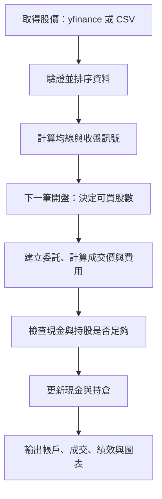

# Quant Flow

Quant Flow 是用 Python 做股票選股與歷史回測的工具。你可以提供股票清單，讓程式下載股價、找出符合均線條件的股票，再查看策略過去的表現。

目前使用「帳戶回測」：模擬買賣後，逐日記錄現金、持有股數與總資產，並和「買進後持有」比較。**目前不會自動下單。** FinLab 台股研究、XQ 即時監控與券商串接是後續規劃。

## 1. 第一次使用：安裝環境

需要 Python 3.13。請在 VS Code 開啟 PowerShell，於專案根目錄執行：

```powershell
cd C:\A_TestSpring\quant-flow-docs
py -3.13 --version
py -3.13 -m venv .venv
.\.venv\Scripts\python.exe -m pip install -e .
```

專案放在其他位置時，請替換第一行路徑。已經有可用的 `.venv`，只要執行最後一行；這也會安裝讀取 Excel 所需的 `openpyxl`。

之後修改 `.py`，儲存後就能重跑，不需要設定 `PYTHONPATH`。若修改 `pyproject.toml` 的套件或指令入口，或重建 `.venv`，請重新執行安裝指令。

## 2. 用 Excel／CSV 選股

### 準備股票清單

編輯根目錄的 `watchlist.csv`，第一列是欄名，下面每列一檔股票。最簡單只需填代號：

```csv
symbol
2330.TW
0050.TW
6488.TWO
```

也可以建立 `watchlist.xlsx`，在第一個工作表填入相同內容。

- 上市股票使用 `.TW`，上櫃股票使用 `.TWO`。純數字代號會自動加 `.TW`。
- Excel 的代號欄請先設成「文字」，避免 `0050` 變成 `50`。程式不會補回已遺失的零。
- CSV 請儲存為 UTF-8。空白列會略過；重複代號只採第一筆及其設定。
- 預設代號欄名是 `symbol`，也接受 `symbol（股票代碼）`。其他欄名可用 `--symbol-column 股票代號` 指定。

### 執行選股

**雙擊根目錄的 `run-screen.cmd`。** 有 `watchlist.xlsx` 時優先讀取 Excel，否則讀取 `watchlist.csv`。

預設選出最新一筆日線中，**5 日均線高於 20 日均線**的股票。均線就是最近幾天的平均價格；這個條件表示短期平均價格高於長期平均價格。

程式會下載股價、選股，並對所有資料完整的股票回測，包含沒有入選的股票。單檔選股或報表失敗時，會記錄原因並繼續處理其他股票。

結果放在 `outputs/時間_識別碼/`：

| 檔案／資料夾 | 用途 |
| --- | --- |
| `selected.csv` | 符合條件的股票，可作為下次的股票清單 |
| `screening.csv` | 全部股票的結果、資料日期與失敗原因；`report_error（報表錯誤）` 記錄報表問題 |
| 各股票代號資料夾 | 該股票的回測報表、圖表與設定檔 |

選股使用資料來源最新可取得的日線。盤中取得的資料可能尚未收盤。

### 調整每檔股票的設定

清單可加入以下欄位，只有 `symbol` 必填：

```csv
symbol,period,short_window,long_window,fee_rate,slippage_rate
2330.TW,2y,10,30,0.001,0.001
0050.TW,,,,,
```

| 欄位 | 意思 | 預設值 |
| --- | --- | --- |
| `period` | 下載多久的歷史資料 | `1y`（一年） |
| `short_window` | 短均線天數 | `5` |
| `long_window` | 長均線天數 | `20` |
| `fee_rate` | 每次成交的手續費率 | `0.001`（0.1%） |
| `slippage_rate` | 模擬成交價比開盤價差多少 | `0.001`（0.1%） |

**設定優先順序：清單有填的值 → 命令列指定的值 → 預設值。** 留空就是沿用下一層設定。選股、回測與輸出都採用各股票的設定，輸出清單也會保留這些參數。

`period` 支援 `1mo、3mo、6mo、1y、2y、5y`（一／三／六個月、一／二／五年）。均線天數必須是正整數，短均線小於長均線。費率用小數填寫，兩種費率都不能為負，合計必須小於 `1`。

### 用指令選股

以下指令擇一執行：

```powershell
# 短均線高於長均線（和雙擊入口相同）
.\.venv\Scripts\quant-flow.exe --symbols-file watchlist.xlsx --screen trend

# 最新一筆日線剛發生黃金交叉：短均線由下往上穿過長均線
.\.venv\Scripts\quant-flow.exe --symbols-file watchlist.csv --screen cross --short-window 10 --long-window 30

# 不篩選，直接對清單內每檔股票回測
.\.venv\Scripts\quant-flow.exe --symbols-file watchlist.csv
```

`trend` 只看目前短均線是否高於長均線；`cross` 則要求最新一筆資料剛發生交叉。若清單已填均線天數，會優先使用清單設定。

`--symbols-file` 和 `--symbol` 只能擇一使用。清單／選股模式不能搭配 `--input-csv` 或 `--config`；股票清單 CSV 與歷史股價 CSV 用途不同。

## 3. 直接回測指定股票

「回測」是用歷史股價模擬策略買賣，查看過去的結果。

```powershell
# 使用預設設定回測台積電
.\.venv\Scripts\quant-flow.exe

# 指定股票、兩年資料與 10／30 日均線
.\.venv\Scripts\quant-flow.exe --symbol 0050.TW --period 2y --short-window 10 --long-window 30

# 一次回測多檔股票，代號以空格分隔
.\.venv\Scripts\quant-flow.exe --symbol 2330.TW 0050.TW 2317.TW --period 2y --short-window 10 --long-window 30
```

預設股票為 `2330.TW`，其他參數與上表相同。策略與買進持有基準各使用初始資金 `100000`。資金目前固定在 `main.py`，還不能用命令列修改。

多檔股票會逐檔獨立回測，各有 `100000` 初始資金，並共用命令列設定；並非多檔股票共用一筆資金的投資組合。沒有取得股價的股票會略過。

要比較成本影響，可分別執行：

```powershell
# 不計手續費與滑價
.\.venv\Scripts\quant-flow.exe --fee-rate 0 --slippage-rate 0

# 手續費與滑價各設為 0.1%
.\.venv\Scripts\quant-flow.exe --fee-rate 0.001 --slippage-rate 0.001
```

資料太短、無法算出長均線時，可能沒有交易，請增加資料期間。全部參數可用 `--help` 查看；也能以 Python 模組方式執行：

```powershell
.\.venv\Scripts\quant-flow.exe --help
.\.venv\Scripts\python.exe -m quant_flow.main
```

## 4. 看報表與比較結果

每次執行都會建立新資料夾，不覆寫歷史報表。資料夾名稱使用電腦本地時間（24 小時制）與識別碼：

```text
outputs/
├── 歷史報表/                       # 已整理的舊報表，新執行不會自動搬移
└── 2026-09-29_15-00-00_a1b2c3d4/   # 一次執行
    ├── 2330.TW/                   # 這檔股票的完整報表
    ├── 0050.TW/
    ├── screening.csv              # 選股模式才有
    └── selected.csv               # 選股模式才有
```

建議先看 `summary.csv` 的績效，再開 `equity.png` 看資產變化，需要查買賣細節時再看 `trades.csv`。

| 每檔股票的檔案 | 內容 |
| --- | --- |
| `summary.csv` | 均線策略與買進持有的累積報酬、最大回撤 |
| `equity.png` | 淨值與回撤曲線，可在 VS Code 點選預覽 |
| `strategy.csv` | 策略每天的持股、現金與總資產 |
| `benchmark.csv` | 買進持有基準每天的帳戶狀態 |
| `trades.csv` | 策略每次成交的方向、股數、價格、費用與現金變化 |
| `benchmark_trades.csv` | 買進持有基準的成交紀錄 |
| `input_prices.csv` | 驗證、排序後，實際用於回測的股價 |
| `config.json` | 本次參數、模型、初始資金與資料來源紀錄，供重跑使用 |
| `中文說明.md` | 報表用途、欄位解釋與數值單位 |

「累積報酬」表示整段期間資產增加或減少多少；「最大回撤」表示資產從先前高點最多跌了多少。CSV 的 `0.12` 是 `12%`，最大回撤 `-0.25` 表示從高點跌了 `25%`。

CSV 欄名採「英文（中文）」，例如 `Cash（現金）`。重跑與比較工具也支援舊版英文欄名。圖表附中文；Windows 使用微軟正黑體，其他系統可安裝 Noto Sans CJK TC。

### 每日帳戶欄位

| 欄位 | 意思 |
| --- | --- |
| `Date` | 台灣時間的模擬開盤時間 |
| `Open` | 原始開盤價，未加滑價 |
| `Target` | 使用前一筆收盤訊號：`1` 希望持有，`0` 希望空手 |
| `Quantity` | 當日交易後持有的股數 |
| `Cash` | 當日交易與費用扣除後的現金 |
| `Market_Value` | 持股數 × 當日原始開盤價 |
| `Total_Equity` | 現金 + 股票市值 |
| `Equity` | 總資產 ÷ 初始資金，例如 `1.12` 表示增加 12% |

`Target` 是當日使用的前一筆訊號，不是當天收盤的新訊號。`strategy.csv` 已不含舊 phase1 的逐日報酬欄位。

成交表包含 `Symbol`（代號）、`Side`（`BUY` 買／`SELL` 賣）、`Quantity`（股數）、`Price`（含滑價的成交價）、`Gross_Amount`（成交金額）、`Fee`（比例手續費）、`Cash_Change`（現金變化）、`Created_At`（委託時間）與 `Executed_At`（成交時間）。買入的現金變化為負，賣出為正；沒有成交時仍會輸出欄名。

需要核對帳戶時，可用以下關係，基準報表也相同：

```text
初始資金 + 成交表 Cash_Change 加總 = 最後一列 Cash
買入股數加總 - 賣出股數加總 = 最後一列 Quantity
Cash + Market_Value = Total_Equity
```

成交金額以 `Decimal` 字串保存，每日帳戶則轉為浮點數供分析，因此核對時可能有微小數值誤差。

### 彙整歷次回測

```powershell
.\.venv\Scripts\quant-flow-compare.exe
```

結果寫入 `outputs/comparison.csv`。再次執行會覆寫這張比較表，各次回測資料夾不受影響；舊版目錄及 `歷史報表/` 內的結果也會讀取。

比較均線參數時，請使用相同股價與費率。日期範圍、資料筆數相同，不代表股價內容完全相同。目前比較表不區分模型 `engine` 與初始資金 `initial_cash`，請查看設定檔，避免混用 phase1 與 phase2 的結果。

## 5. 用保存的資料重跑

以下兩種方式都只支援單檔股票。可在 VS Code 對檔案按右鍵 →「複製路徑」，再替換指令中的引號內容。

### 只讀取股價 CSV

```powershell
.\.venv\Scripts\quant-flow.exe --symbol 2330.TW --input-csv "貼上 input_prices.csv 的完整路徑" --short-window 10 --long-window 30
```

不下載股價，`--period` 不生效。均線、費率使用本次命令列設定或預設值，不會讀取舊設定。請自行確認 `--symbol` 與 CSV 是同一檔股票，程式不會驗證股票身分。

CSV 日期會轉成 UTC，帳戶回測再轉成台灣時間（`Asia/Taipei`），以每筆資料日期上午 9 點記錄開盤。因此輸入日期與帳戶時間可能顯示不同時區。

### 連同設定一起重跑

```powershell
.\.venv\Scripts\quant-flow.exe --config "貼上 config.json 的完整路徑"
```

設定檔會覆蓋股票、均線、費率與輸入股價檔設定，並停用下載期間。股價檔依設定檔所在目錄與 `data.file` 尋找；搬移報表時請保留整個執行資料夾。

重跑要使用相同程式邏輯與相容套件。目前 `pyproject.toml` 沒有鎖定相依套件版本。

**`engine` 與 `initial_cash` 目前只供紀錄。** 修改它們不會切換回測模型或初始資金。舊 phase1 設定也會用現在的帳戶模型重跑；股數、剩餘現金與成本計算不同，結果可能與舊報表不同。

## 6. 回測怎麼模擬買賣

目前以台股日線、單一計價幣別為假設，使用 `account_v1` 帳戶模型：

- **只做多。** 空手且訊號要求持有時，用現金買入負擔得起的整數股數，包含交易成本；不足一股就略過。已持有時不加碼，訊號要求空手時全部賣出。
- **前一筆收盤決定方向，當日開盤模擬成交。** 股數在開盤時決定，委託與成交可有相同時間。這是日線的簡化方式，實際市場不保證能以該價格成交。
- **成本計算：** 買價 = 開盤價 × `(1 + slippage_rate)`；賣價 = 開盤價 × `(1 - slippage_rate)`；手續費 = 成交金額 × `fee_rate`。滑價已算進價格，不再另扣。
- **成交前檢查現金與可賣股數，更新帳戶時也會檢查。** 現金與平均成本使用 `Decimal`；平均成本不含手續費，部分賣出不改變剩餘持股的平均成本。
- **買進持有基準也使用 100000 與整數股。** 從第二筆資料開盤嘗試買入，不足一股時後續繼續嘗試。策略等待長均線形成的空手期間，也包含在比較期間內。
- **結束時不強制賣出。** 最後淨值以最後一筆開盤價估算，回撤不包含盤中跌幅。
- **尚未模擬的細節：** 部分成交、流動性、委託狀態、重複成交防護、交易稅、最低手續費、費用取整與價格跳動單位。市價委託目前一次全部成交。
- **股價處理限制：** yfinance 使用未自動調整價格，尚未處理股息、拆股與交易日曆缺漏。

## 7. 開發與測試

### 執行測試

測試放在 `src/quant_flow/tests`。以下指令擇一使用：

```powershell
# 全部測試
.\.venv\Scripts\python.exe -m unittest discover -s src/quant_flow/tests -v

# 命令列與設定解析
.\.venv\Scripts\python.exe -m unittest discover -s src/quant_flow/tests -p test_cli.py -v

# 離線帳戶回測與報表輸出
.\.venv\Scripts\python.exe -m unittest discover -s src/quant_flow/tests -p test_main_account.py -v
```

測試涵蓋委託、成交、持倉、資金檢查、股數計算、逐日回測，以及離線報表、圖片、成交現金核對與零成交輸出。

### 目前流程

舊 phase1 的向量化回測仍保留在專案內，主程式已改用 phase2 的帳戶模型：



### 開發進度與後續方向

長期目標是串起「取得資料 → 研究策略 → 選股與交易訊號 → 風控與下單 → 分析結果 → 改善策略」。預計用 FinLab／其他來源取得價格、成交量、財報、營收、籌碼與因子資料，以 Python 做研究與策略管理，再接上 XQ 即時行情、警示及券商 API／人工下單。

開發分成六個階段。各階段的工作項目與完成條件統一維護於 [功能與開發路線圖](./FEATURES_ROADMAP.md)，[prompt.md](./docs/prompt.md) 保留原始規劃。以下提供進度概覽：

| 階段 | 目標與完成條件 | 目前狀態 |
| --- | --- | --- |
| phase1：基礎回測 | 取得股價、產生策略訊號、完成回測；固定資料與參數時能重現完整流程 | 基礎流程完成，逐筆成交由 phase2 補上；跨模型版本不保證相同結果 |
| phase2：模擬交易 | 管理現金與持倉，串起委託、成交及帳戶更新，並能由交易紀錄核對 | 基礎版本完成；可設定初始資金、模型相容性與完整委託管理待補 |
| phase3：績效與研究驗證 | 比較報酬、最大回撤、夏普比率及基準，分析滑價，記錄時間順序與前視偏誤檢查，回饋策略調整 | 已有報酬、回撤、買進持有比較、固定滑價與訊號時間測試；夏普比率及完整研究檢查未完成 |
| phase4：統一資料介面 | 定義 `DataProvider`，整理 Yahoo 與 FinLab 來源的欄位、時間和缺漏，讓共通資料能接入同一回測流程 | 待實作 |
| phase5：台股策略研究 | 使用 FinLab 資料，確認資料可取得時間，建立因子／選股規則；至少完成一個策略的回測、分析與可重現研究紀錄 | 待實作 |
| phase6：即時監控與交易 | 串接 XQ／券商，先驗證模擬交易（Paper Trading），訂定資金、部位與停損風控限制，再做小資金實盤並分析與回測的差異 | 待實作 |

從一開始就要確認資料與訊號的時間順序，避免回測使用決策當下尚未取得的資訊（前視偏誤）。更完整的目標與架構見下方相關文件。

### 專案目錄

以下列出目前的文件、程式模組與測試檔案，並附上用途。各套件中的 `__init__.py` 僅作為套件識別，因此省略；`.venv/` 與 `outputs/` 是本機環境及執行產物。

```text
quant-flow-docs/
├── README.md                         # 使用說明
├── FEATURES_ROADMAP.md               # 開發進度、待辦與完成條件
├── pyproject.toml                    # 相依套件、Python 版本與指令入口
├── .gitignore                        # Git 不追蹤的檔案與資料夾
├── watchlist.csv                     # 預設股票清單
├── run-screen.cmd                    # 雙擊執行選股，讀取根目錄清單
├── .venv/                            # 本機 Python 虛擬環境
├── docs/
│   ├── commentary.md                 # 程式解說（Java 開發者轉 Python）
│   ├── ultimate-goal.md              # 專案長期目標
│   ├── program-architecture.md       # 系統架構說明
│   ├── prompt.md                     # 六階段開發原始規劃
│   ├── git-flow.md                   # Git 分支與開發流程
│   └── flow.jpg                      # 流程圖
├── outputs/                          # 執行後產生的報表，Git 忽略
└── src/
    └── quant_flow/
        ├── main.py                   # 串接資料、回測與報表的主流程
        ├── cli.py                    # 解析命令列參數與重跑設定
        ├── screening.py              # 均線選股與選股清單輸出
        ├── data/
        │   ├── normalizer.py         # 驗證股價並依時間排序
        │   ├── csv_format.py         # 中英文 CSV 欄名與讀寫格式
        │   ├── symbols.py            # 讀取股票清單與每檔參數
        │   └── providers/
        │       ├── base.py           # 待實作：共用 DataProvider 介面
        │       ├── yahoo_finance.py  # 從 yfinance 下載股價
        │       ├── csv_provider.py   # 讀取保存的股價 CSV
        │       └── finlab.py         # 待實作：FinLab 資料來源
        ├── strategy/
        │   └── moving_average.py     # 計算均線與持有訊號
        ├── signals/
        │   └── signal.py             # 將策略訊號轉成交易事件
        ├── backtest/
        │   ├── simulator.py          # phase1 向量化回測（保留）
        │   ├── account_simulator.py  # phase2 逐日帳戶回測
        │   └── execution.py          # 依開盤價與目標持倉處理買賣
        ├── portfolio/
        │   ├── portfolio.py          # 管理現金、持倉與總資產
        │   ├── risk.py               # 檢查現金與可賣股數
        │   └── sizing.py             # 計算含成本後可買的整數股數
        ├── orders/
        │   ├── order.py              # 委託資料模型
        │   └── executor.py           # 串接成交、檢查與帳戶更新
        ├── fills/
        │   ├── fill.py               # 成交資料與現金變化
        │   └── simulator.py          # 模擬成交價、滑價與手續費
        ├── positions/
        │   └── position.py           # 管理持股數與平均成本
        ├── performance/
        │   ├── metrics.py            # 計算累積報酬與最大回撤
        │   └── benchmark.py          # phase1 買進持有基準（保留）
        ├── reporting/
        │   ├── exporter.py           # 輸出帳戶、績效與成交 CSV
        │   ├── comparison.py         # 彙整歷次回測結果
        │   ├── charts.py             # 繪製淨值與回撤圖
        │   └── guide.py              # 產生報表的中文說明
        └── tests/
            ├── test_account_simulator.py # 逐日帳戶回測
            ├── test_backtest.py          # 向量化回測
            ├── test_benchmark.py         # 買進持有基準
            ├── test_cli.py               # 命令列參數與設定檔
            ├── test_csv_replay.py        # 保存股價的重跑流程
            ├── test_execution.py         # 開盤買賣處理
            ├── test_executor.py          # 委託執行與帳戶更新
            ├── test_fill.py              # 成交模型與現金變化
            ├── test_fill_simulator.py    # 成交價、滑價與費用
            ├── test_main_account.py      # 主流程、報表與圖片輸出
            ├── test_metrics.py           # 績效指標
            ├── test_normalizer.py        # 股價驗證與排序
            ├── test_order.py             # 委託模型
            ├── test_portfolio.py         # 現金與持倉管理
            ├── test_position.py          # 持股數與平均成本
            ├── test_screening.py         # 均線選股
            ├── test_sizing.py            # 可買股數計算
            └── test_watchlist_options.py # 股票清單的個別參數
```

## 相關文件

- [功能與開發路線圖](./FEATURES_ROADMAP.md)
- [程式解說（Java 開發者轉 Python）](./docs/commentary.md)
- [最終目標](./docs/ultimate-goal.md)
- [程式架構](./docs/program-architecture.md)
- [開發階段原始規劃](./docs/prompt.md)
- [Git Flow 分支說明](./docs/git-flow.md)
