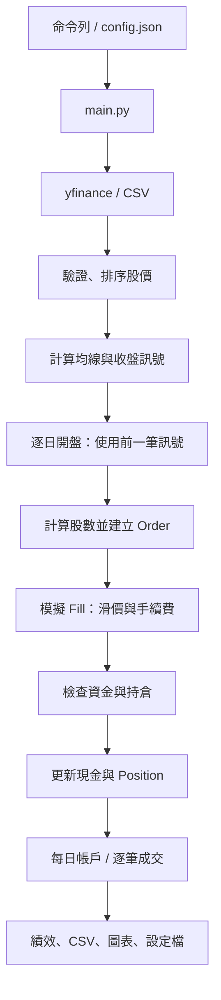

# Quant Flow 程式解說

本文件以「已熟悉 Java、正在學 Python」為閱讀背景，說明目前程式如何運作。操作指令的完整清單請搭配 [README.md](./README.md)。以下以目前主程式使用的 `account_v1` 帳戶回測為準。

## 1. 目前這個專案做什麼

輸入一檔股票的歷史日線，以短、長均線決定持有或空手，再模擬委託、成交、現金與股數變化，最後產生績效及報表。

它目前是本機歷史模擬，沒有連到券商下單。主流程一次研究一檔股票，初始現金固定為 `100000`，使用台股日線的開盤時間假設。



## 2. 建議閱讀程式的順序

不用一次讀完所有檔案。先看主流程，再沿函式呼叫追進去。

| 順序 | 檔案 | 閱讀重點 |
| --- | --- | --- |
| 1 | [main.py](./src/quant_flow/main.py) | 資料怎麼流過整個系統 |
| 2 | [cli.py](./src/quant_flow/cli.py) | 命令列與設定檔如何決定參數 |
| 3 | [normalizer.py](./src/quant_flow/data/normalizer.py) | 哪些資料能進入策略 |
| 4 | [moving_average.py](./src/quant_flow/strategy/moving_average.py) | 如何產生持倉目標 |
| 5 | [account_simulator.py](./src/quant_flow/backtest/account_simulator.py) | 每一天如何執行與記帳 |
| 6 | [execution.py](./src/quant_flow/backtest/execution.py) | 持倉目標如何變成委託 |
| 7 | [executor.py](./src/quant_flow/orders/executor.py) | 成交、風控、帳戶更新的協調 |
| 8 | [portfolio.py](./src/quant_flow/portfolio/portfolio.py) | 現金、持倉、市值與總資產 |
| 9 | [metrics.py](./src/quant_flow/performance/metrics.py) | 報酬與回撤的計算 |
| 10 | [exporter.py](./src/quant_flow/reporting/exporter.py) | 如何保存每日結果與逐筆成交 |

## 3. 專案怎麼啟動

在專案根目錄安裝開發模式：

```powershell
.\.venv\Scripts\python.exe -m pip install -e .
```

執行：

```powershell
.\.venv\Scripts\quant-flow.exe --symbol 2330.TW --period 1y
```

[pyproject.toml](./pyproject.toml) 的設定：

```toml
[project.scripts]
quant-flow = "quant_flow.main:main"
quant-flow-compare = "quant_flow.reporting.comparison:main"
```

`quant-flow` 入口會匯入 `quant_flow.main`，然後呼叫 `main()`。這個名稱是專案設定的，不是 Python 保留字。

也可以用模組方式執行：

```powershell
.\.venv\Scripts\python.exe -m quant_flow.main
```

此時檔案底部的 `if __name__ == "__main__":` 會成立，進而呼叫 `main()`。一般 `import` 該模組時，不會因這段入口判斷而啟動回測。

安裝後不必設定 `PYTHONPATH`。修改 Python 原始碼通常直接重跑即可；修改套件相依項目或指令入口後，需重新執行安裝指令。

`__init__.py` 用於一般 Python 套件的標記與初始化，目前多數留空即可。模組可以直接包含函式，不必像 Java 一樣把所有功能都放在 class 裡。

## 4. 參數從哪裡來

`cli.py` 使用 `argparse`，類似替 Java 的 `String[] args` 加上一層解析及驗證。

| 命令列參數 | Python 屬性 | 預設值 |
| --- | --- | --- |
| `--symbol` | `args.symbol` | `2330.TW` |
| `--period` | `args.period` | `1y` |
| `--short-window` | `args.short_window` | `5` |
| `--long-window` | `args.long_window` | `20` |
| `--fee-rate` | `args.fee_rate` | `0.001` |
| `--slippage-rate` | `args.slippage_rate` | `0.001` |
| `--input-csv` | `args.input_csv` | `None` |
| `--config` | `args.config` | `None` |

短均線必須小於長均線，且兩者為正整數。CLI 也會驗證費率非負、合計小於 1。

三種資料取得方式：

1. 一般執行：由 yfinance 下載指定期間。
2. 指定 `--input-csv`：使用檔案全部資料，忽略 `--period`；均線與費率仍取命令列值或預設值。
3. 指定 `--config`：設定檔覆蓋股票、均線、費率與 CSV 路徑；CSV 路徑相對於設定檔所在資料夾解析。

設定檔中的 `engine` 與 `initial_cash` 目前只是紀錄，CLI 尚未依這兩欄切換模型或資金。初始現金仍由 `main.py` 固定為 `100000`。舊 phase1 設定也會用新的帳戶模型執行，結果可能不同。

## 5. DataFrame 如何變成訊號

`DataFrame` 可以理解成有索引與欄位的記憶體表格，`Series` 則通常是一欄資料。pandas 支援整欄計算，不必每個運算都寫逐列迴圈。

```python
close_prices = prices["Close"]       # 取單欄，得到 Series
latest_close = close_prices.iloc[-1] # 依位置取最後一筆
```

`normalize_prices()` 會：

- 拒絕空資料及缺少 `Open`、`Close` 欄位。
- 要求日期索引，拒絕空日期與重複時間戳，並依時間排序。
- 將價格轉為數值，拒絕缺失、無限大及非正價格。
- 回傳副本，保留呼叫端的輸入。

它不會推算漏掉了哪個交易日，也不會自動補價格。

均線策略主要公式：

```python
short_ma = prices["Close"].rolling(5, min_periods=5).mean()
long_ma = prices["Close"].rolling(20, min_periods=20).mean()
signal = (short_ma > long_ma).astype(int)
```

這裡的 5、20 是資料列數。日線資料通常代表 5、20 個交易日，不是日曆天。資料不足時均線為 `NaN`，這裡的比較結果會讓訊號保持零。

`Signal = 1` 表示希望持有；`Signal = 0` 表示希望空手。它不是每天新增一筆買單。

[signal.py](./src/quant_flow/signals/signal.py) 另外計算目標狀態的變化：`1` 為進場、`-1` 為出場、`0` 為不變。主流程仍產生這個 `Trade_Event`，但帳戶回測實際讀取的是 `Signal`，不是直接把每個事件當作必定成交的交易。

## 6. 最重要的時間順序

| 時點 | 當時能做的事 |
| --- | --- |
| 第一天收盤 | 使用截至當天的收盤價，計算目標訊號 |
| 第二天開盤 | 讀取前一天訊號，依目前開盤價計算股數並模擬成交 |
| 第二天開盤交易後 | 記錄現金、持倉、市值與淨值 |
| 第二天收盤 | 新訊號供下一筆交易日資料使用 |

`account_simulator.py` 透過 `data["Signal"].iloc[index - 1]` 取得前一筆訊號；第一筆之前沒有已知訊號，因此第一筆先空手。

回測把輸入日期轉至 `Asia/Taipei`，以當天上午 9 點記錄開盤事件。委託與成交可以使用相同時間戳，表示同一個模擬步驟。模型假設能用當下開盤價估算並立即執行，並非真實交易的成交保證。

下一個交易日由資料的下一列決定，不是自行加一個日曆天。資料若漏列，仍需要另外的交易日曆檢查才能發現。

## 7. Order、Fill、Position、Portfolio 的分工

| 模型 | 代表什麼 | 主要資料與行為 |
| --- | --- | --- |
| `Order` | 交易意圖 | 股票、方向、股數、建立時間 |
| `Fill` | 成交結果 | 對應委託、成交股數、價格、費用、成交時間 |
| `Position` | 單檔股票持倉 | 股數、平均成本、依成交產生新的持倉 |
| `Portfolio` | 帳戶 | 現金、各股票持倉、市值、總資產 |

`Order`、`Fill`、`Position` 使用 `@dataclass(frozen=True)`，一般欄位重新賦值會被拒絕。`Position.apply_fill()` 回傳新物件，原物件不變。

`Portfolio` 是可更新物件。它先算出新的現金與持倉、確認合法，再更新欄位。這避免單次操作失敗時只更新一半，但目前不是具備執行緒鎖定或資料庫交易的系統。

開盤執行時的決策：

| 目標 | 現況 | 動作 |
| --- | --- | --- |
| 持有 | 空手 | 計算可買股數；大於零才建立買單 |
| 持有 | 已持有 | 保持股數，不加碼 |
| 空手 | 已持有 | 全數賣出 |
| 空手 | 空手 | 不操作 |

`execute_market_order()` 先計算候選成交，再驗證資金與可賣股數，最後更新帳戶並回傳成交。成功後不能再自行呼叫一次 `apply_fill()`，否則會重複入帳；目前尚未建立成交識別碼與去重機制。

## 8. 股數、成本與現金如何計算

### 可買股數

例如現金 `10000`、開盤價 `100`、滑價率與手續費率各 `0.001`：

```text
買入成交價 = 100 × 1.001 = 100.1
每股所需資金 = 100.1 × 1.001 = 100.2001
最多可買 = 向下取整（10000 ÷ 100.2001）= 99 股
```

[sizing.py](./src/quant_flow/portfolio/sizing.py) 還會用成交器相同的金額計算順序檢查邊界，確保目前股數買得起、再多一股買不起。買不起一股時回傳零，不建立零股數委託。

### 滑價與手續費

```text
買入成交價 = 開盤價 ×（1 + 滑價率）
賣出成交價 = 開盤價 ×（1 - 滑價率）
成交金額 = 成交價 × 股數
手續費 = 成交金額 × 手續費率
買入現金變化 = -（成交金額 + 手續費）
賣出現金變化 = 成交金額 - 手續費
```

滑價已反映在價格裡，不再額外扣一次滑價費。這是固定比例的簡化模型，沒有稅、最低費用與市場價格跳動單位。

### 平均成本與市值

```text
加碼後平均成本 =（原股數 × 原平均成本 + 新買入成交金額）÷ 新總股數
股票市值 = 股數 × 目前估值價格
總資產 = 現金 + 股票市值
```

平均成本不含手續費，費用已反映於現金。部分賣出不改變剩餘股票的平均成本；全部賣出後，股數與平均成本歸零。

開盤買入後，帳戶以原始開盤價估值，因此滑價和手續費會立即降低淨值。估值不是以含滑價的成交價代替市場價格。

## 9. 為什麼用 Decimal

交易模型使用 `Decimal`，可以類比 Java 的 `BigDecimal`。建議从字串建立：

```python
from decimal import Decimal

price = Decimal("100.10")
```

直接用 `Decimal(100.10)` 會先經過二進位浮點近似。從 pandas 或 CLI 浮點值轉入時，程式使用 `Decimal(str(value))`；這能避免直接轉入浮點展開值，但無法恢復輸入早已損失的精度。

Decimal 仍有運算精度設定，不代表無限精度。帳戶計算保留 Decimal，逐筆成交金額以字串輸出；每日分析表轉成 float，方便 pandas 與 Matplotlib 使用，因此核對報表時要容許極小誤差。

## 10. 回測結果與績效

`run_account_backtest()` 回傳兩個值：

```python
history, fills = run_account_backtest(...)
```

這是 tuple 解包：`history` 是每日帳戶 DataFrame，`fills` 是成交物件列表。

| 每日欄位 | 意義 |
| --- | --- |
| `Target` | 今日使用的前一筆收盤持倉目標 |
| `Quantity` | 交易後實際股數 |
| `Cash` | 剩餘現金 |
| `Market_Value` | 股票市值 |
| `Total_Equity` | 實際總資產金額 |
| `Equity` | 總資產除以初始現金 |

`Equity = 1.1` 代表相對初始資金增加 10%。績效函式採初始正規化淨值為 1 的約定：

```text
累積報酬 = 最後淨值 - 1
當期回撤 = 當期淨值 ÷ 截至當期的歷史最高淨值 - 1
最大回撤 = 回撤序列最小值
```

初始值 1 也算入歷史高點。若第一筆淨值就是 0.98，不能把它當作無損失的新起點。

例如淨值為 `1 → 1.2 → 0.9 → 1.1`，累積報酬為 10%，最大回撤為 `0.9 / 1.2 - 1 = -25%`。

策略與基準現在都用帳戶模型。基準將所有 `Signal` 設為 1，因此第二筆資料開盤開始嘗試買入，持有後不再加碼。若資金不足一股，後續日期仍會嘗試。

phase1 的 [backtest/simulator.py](./src/quant_flow/backtest/simulator.py) 與 [performance/benchmark.py](./src/quant_flow/performance/benchmark.py) 仍保留供學習及測試；目前主程式不使用它們。兩代模型在整數股、剩餘現金與成本計算上不同。

## 11. 報表如何閱讀與核對

每次執行建立新的 `outputs/<時間戳_識別碼>/`：

| 檔案 | 先看什麼 |
| --- | --- |
| `config.json` | 股票、參數、模型、初始資金與資料範圍 |
| `input_prices.csv` | 這次實際使用的股價 |
| `strategy.csv` | 每日股數、現金與總資產 |
| `trades.csv` | 每筆買賣的價格、費用及現金變化 |
| `benchmark.csv` | 基準的每日帳戶 |
| `benchmark_trades.csv` | 基準的成交明細 |
| `summary.csv` | 策略與基準的累積報酬及 MDD |
| `equity.png` | 淨值與回撤曲線 |

帳戶核對：

```text
初始現金 + 所有 Cash_Change = 最後 Cash
所有買入股數 - 所有賣出股數 = 最後 Quantity
Cash + Market_Value = Total_Equity
```

零成交也會輸出有欄名的成交 CSV。期末不強制賣出；尚有持倉時，現金不等於總資產。

執行 `quant-flow-compare.exe` 會產生 `outputs/comparison.csv`。目前比較表尚未加入模型與初始資金欄位，請先看各次設定，避免把 phase1、phase2 或不同輸入資料混成相同條件比較。

## 12. 常見 Python 寫法與 Java 對照

| Python 寫法 | 本專案用途與 Java 類比 |
| --- | --- |
| `def f(x: int) -> int` | 型別提示；不等同 Java 編譯期強制型別檢查 |
| `self` | 類似 `this`，但實例方法明寫第一個參數 |
| `@dataclass` | 自動產生初始化、表示及相等比較，減少資料物件樣板碼 |
| `__post_init__()` | dataclass 初始化欄位後的驗證步驟 |
| `@property` | 用屬性語法讀取計算結果，例如 `fill.cash_change` |
| `field(default_factory=dict)` | 每個帳戶建立自己的 Map，避免共用可變容器 |
| `dict[str, Position]` | 類似 `Map<String, Position>` |
| `Fill \| None` | 結果可能是成交或無操作；不是自動包裝的 Optional 物件 |
| `a if condition else b` | 類似 `condition ? a : b` |
| `with ...` | 透過 context manager 管理區塊進出，常用於資源清理 |
| `raise ValueError(...)` | 拋出例外，類似參數不合法時拋出例外 |
| `Path / "file.csv"` | 以 Path 運算子組合路徑，類似 `Path.resolve()` 的使用場景 |
| `f"{value:.2%}"` | 格式化字串，將小數顯示為百分比 |

`frozen=True` 是淺層的修改限制，不保證內部可變物件都不可修改。Python 的 `bool` 也是 `int` 的子類別，因此股數驗證使用 `type(quantity) is int`，避免把 `True` 當成一股。

## 13. 怎麼測試與找錯誤

執行全部測試：

```powershell
.\.venv\Scripts\python.exe -m unittest discover -s src/quant_flow/tests -v
```

只執行主程式離線整合測試：

```powershell
.\.venv\Scripts\python.exe -m unittest discover -s src/quant_flow/tests -p test_main_account.py -v
```

`unittest.TestCase` 類似 JUnit 測試類別，`setUp()` 類似 `@BeforeEach`；以 `test_` 開頭的方法會被搜尋。`assertRaises()` 類似 `assertThrows()`，`subTest()` 用於同一邏輯檢查多組案例。

測試從能手算的資料開始，分別檢查成交方向、成本、資金不足、超賣、平均成本，以及時間順序。整合測試再確認主程式能離線產生 CSV、圖片，並核對成交與帳戶。當前共有 43 個測試。

| 現象 | 優先檢查 |
| --- | --- |
| 找不到 `quant_flow` 或執行入口 | 是否在目前 `.venv` 執行過 `pip install -e .` |
| 找不到測試目錄 | `-s` 是否指定 `src/quant_flow/tests` |
| 找不到 CSV | 使用 VS Code「複製路徑」，並用引號包住 |
| 修改設定檔的資金卻沒變 | `initial_cash` 目前只記錄，未用於參數載入 |
| 沒有成交 | 訊號是否形成、資料是否足夠，以及資金是否買得起一股 |
| 結果與舊報表不同 | 模型版本、資料、均線、費率及套件版本是否一致 |

## 14. 修改功能時應從哪裡開始

| 想調整的行為 | 優先查看 |
| --- | --- |
| 命令列選項與設定載入 | `cli.py` |
| 換資料來源 | `data/providers/` |
| 資料清理規則 | `data/normalizer.py` |
| 選股或進出場規則 | `strategy/moving_average.py` |
| 買入多少股 | `portfolio/sizing.py` |
| 成交價格與費用 | `fills/simulator.py` |
| 帳戶風控 | `portfolio/risk.py` 與帳戶更新檢查 |
| 每日事件順序 | `backtest/account_simulator.py` |
| 績效公式 | `performance/metrics.py` |
| CSV、圖表與比較表 | `reporting/` |

`base.py` 與 `finlab.py` 目前仍是空白骨架。多股配置、部分成交、成交去重、真實交易稅費、Sharpe Ratio、完整交易日曆檢查與券商串接尚未完成。下一個直接影響重跑一致性的工作，是讓設定載入與比較表能辨識模型及初始資金。
