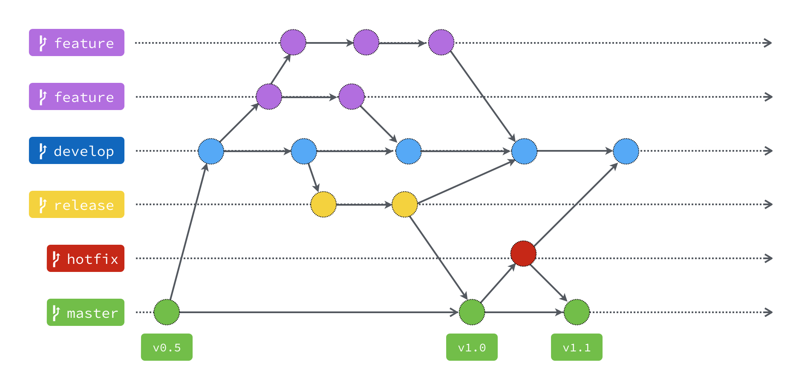

# Git Flow 分支說明

| 分支 | 用途 | 從哪裡建立 | 完成後合併到 |
| --- | --- | --- | --- |
| `master` | 保存穩定、可上線的版本，通常會加上版本標籤；透過合併接收變更，不直接開發。 | — | — |
| `develop` | 整合開發中的功能，作為下一個版本的開發基礎。 | `master` | 透過 `release` 整理後發布 |
| `feature` | 開發個別新功能。 | `develop` | `develop` |
| `release` | 進行發布前的最後測試與修正。 | `develop` | `master` 和 `develop` |
| `hotfix` | 緊急修復線上版本的問題。 | `master` | `master` 和 `develop` |

`master` 和 `develop` 是長期保留的分支；`feature`、`release`、`hotfix` 通常在任務完成並合併後刪除。

`release` 與 `hotfix` 的修正也要合併回 `develop`，讓後續版本包含相同修正。

參考來源：[為你自己學 Git：Git Flow 是什麼？為什麼需要這種東西？](https://gitbook.tw/chapters/gitflow/why-need-git-flow)
